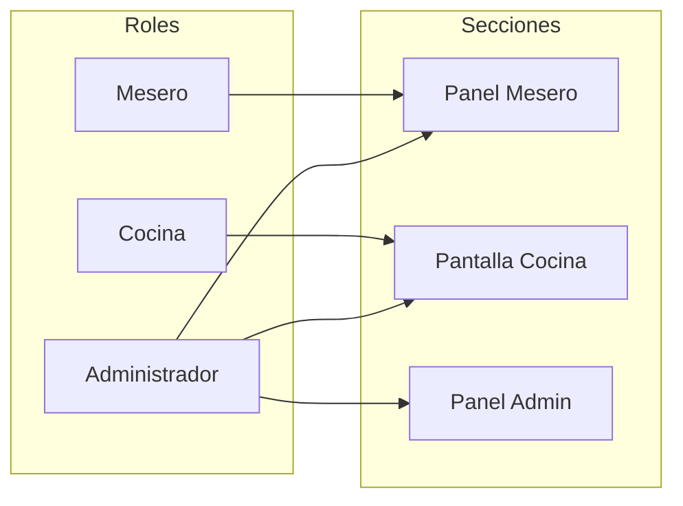

# Plan: Agregar rol "cocina" al sistema

## 🔍 Diagnóstico

El rol `cocina` **no existe** en varias partes del sistema, lo que impide crear empleados de cocina:

| Componente | ¿Incluye `cocina`? |
|---|---|
| `AdminLogin.tsx` (creación de usuarios) | ✅ Sí |
| `AdminDashboard.tsx` (gestión de empleados) | ❌ **No** |
| `OrderContext.tsx` (UserCredentials) | ❌ **No** |
| `types.ts` / `Schema.ts` (Mesero.rol) | ❌ **No** |
| `AccountContext.tsx` (loginCocina) | ✅ Sí |
| `RoleAccessModal.tsx` (validación) | ✅ Sí |

Las reglas de acceso YA están correctamente implementadas en `AdminLogin.tsx` y `RoleAccessModal.tsx`:
- **Mesero** → solo panel de mesero
- **Cocina** → solo pantalla de cocina
- **Admin** → todas las secciones

Solo falta agregar `cocina` donde no existe para poder crear empleados de cocina.

---

## 📋 Reglas de acceso (confirmadas por el usuario)

---

## 📋 Tareas (5 archivos)

### 1. Agregar `'cocina'` a los tipos de datos base
- [ ] **`src/types.ts:94`** — `rol: 'mesero' | 'admin'` → `rol: 'mesero' | 'admin' | 'cocina'`
- [ ] **`src/db/Schema.ts:18`** — `rol: 'mesero' | 'admin'` → `rol: 'mesero' | 'admin' | 'cocina'`

### 2. Agregar `'cocina'` a UserCredentials en OrderContext
- [ ] **`src/context/OrderContext.tsx:7`** — `role: 'admin' | 'mesero' | 'repartidor'` → `role: 'admin' | 'mesero' | 'cocina' | 'repartidor'`

### 3. Actualizar AdminDashboard para crear empleados con rol cocina
- [ ] **`src/components/AdminDashboard.tsx:52`** — Agregar `'cocina'` a interfaz `UserCredentials`
- [ ] **`src/components/AdminDashboard.tsx:72`** — `useState<'mesero' | 'repartidor'>` → `useState<'mesero' | 'cocina' | 'repartidor'>`
- [ ] **`src/components/AdminDashboard.tsx:767`** — Agregar `<option value="cocina">Cocina</option>` en el `<select>`
- [ ] **`src/components/AdminDashboard.tsx:846-856`** — Agregar color naranja + ícono `ChefHat` para rol `cocina` en lista de empleados

### 4. Actualizar AdminLogin (ya tiene cocina, verificar consistencia)
- [ ] **`src/components/AdminLogin.tsx`** — Ya incluye `cocina` ✅. Solo verificar que el `handleRoleSelect` restrinja correctamente (ya lo hace).

### 5. Verificar RoleAccessModal y AccountContext
- [ ] **`src/components/RoleAccessModal.tsx`** — Ya valida correctamente ✅ (solo admin y cocina pueden acceder a cocina)
- [ ] **`src/context/AccountContext.tsx`** — `loginCocina` ya acepta admin y cocina ✅

---

## 📁 Archivos a modificar (4 archivos)

| # | Archivo | Cambio |
|---|---------|--------|
| 1 | `src/types.ts:94` | `rol: 'mesero' \| 'admin' \| 'cocina'` |
| 2 | `src/db/Schema.ts:18` | `rol: 'mesero' \| 'admin' \| 'cocina'` |
| 3 | `src/context/OrderContext.tsx:7` | Agregar `'cocina'` a `UserCredentials.role` |
| 4 | `src/components/AdminDashboard.tsx` | Interfaz + estado + select + estilos para rol cocina |