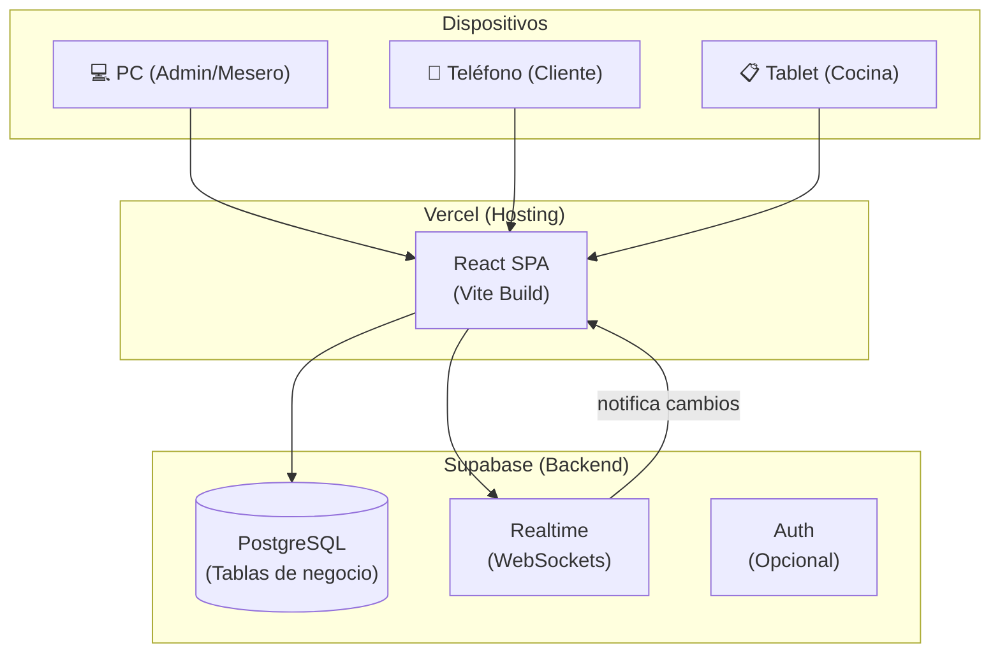

# Plan de Migración: Vercel (Hobby) + Supabase (Gratuito)

## Objetivo

Desplegar "El Buen Café" en Vercel y migrar toda la lógica de negocio de localStorage/IndexedDB a Supabase PostgreSQL, habilitando tiempo real para sincronización multi-dispositivo (cocina, meseros, clientes).

---

## Arquitectura Objetivo



---

## Fase 0: Preparación y Configuración Inicial

### 0.1 Configurar proyecto Supabase

- [ ] Verificar que el proyecto Supabase actual (`klrjltzwuzakclfzngbs`) está activo
- [ ] Crear tablas SQL en Supabase (ver esquema abajo)
- [ ] Configurar Row Level Security (RLS) para cada tabla
- [ ] Habilitar Realtime para las tablas que necesitan sincronización
- [ ] Configurar políticas de acceso (anon key para lecturas públicas, service key para escrituras)

### 0.2 Esquema de Base de Datos (SQL)

**Tablas a crear en Supabase:**

```sql
-- Mesas (catálogo estático)
CREATE TABLE mesas (
  id SERIAL PRIMARY KEY,
  numero TEXT NOT NULL UNIQUE,
  capacidad INTEGER NOT NULL DEFAULT 4,
  estado TEXT NOT NULL DEFAULT 'LIBRE' CHECK (estado IN ('LIBRE', 'OCUPADA', 'COBRADA')),
  ubicacion TEXT,
  created_at TIMESTAMPTZ DEFAULT NOW()
);

-- Meseros (personal)
CREATE TABLE meseros (
  id SERIAL PRIMARY KEY,
  nombre TEXT NOT NULL,
  username TEXT NOT NULL UNIQUE,
  password_hash TEXT NOT NULL,
  rol TEXT NOT NULL DEFAULT 'mesero' CHECK (rol IN ('mesero', 'admin', 'cocina')),
  activo BOOLEAN NOT NULL DEFAULT true,
  created_at TIMESTAMPTZ DEFAULT NOW()
);

-- Cuentas (entidad viva)
CREATE TABLE cuentas (
  id SERIAL PRIMARY KEY,
  mesa_id INTEGER NOT NULL REFERENCES mesas(id),
  mesero_id INTEGER NOT NULL REFERENCES meseros(id),
  estado TEXT NOT NULL DEFAULT 'ABIERTA' CHECK (estado IN ('ABIERTA', 'COBRADA')),
  total_acumulado DECIMAL(10,2) NOT NULL DEFAULT 0,
  fecha_apertura TIMESTAMPTZ NOT NULL DEFAULT NOW(),
  fecha_cierre TIMESTAMPTZ,
  metodo_pago TEXT CHECK (metodo_pago IN ('efectivo', 'electronico')),
  total_pagado DECIMAL(10,2),
  cambio DECIMAL(10,2),
  notas TEXT,
  created_at TIMESTAMPTZ DEFAULT NOW()
);

-- Minicomandas (comandas enviadas a cocina)
CREATE TABLE minicomandas (
  id SERIAL PRIMARY KEY,
  cuenta_id INTEGER NOT NULL REFERENCES cuentas(id) ON DELETE CASCADE,
  mesa_id INTEGER NOT NULL REFERENCES mesas(id),
  mesero_id INTEGER NOT NULL REFERENCES meseros(id),
  estado TEXT NOT NULL DEFAULT 'PENDIENTE' CHECK (estado IN ('PENDIENTE', 'LISTO', 'ENTREGADO')),
  fecha_envio TIMESTAMPTZ NOT NULL DEFAULT NOW(),
  fecha_entrega TIMESTAMPTZ,
  total DECIMAL(10,2) NOT NULL DEFAULT 0
);

-- Items de minicomanda
CREATE TABLE items_minicomanda (
  id SERIAL PRIMARY KEY,
  minicomanda_id INTEGER NOT NULL REFERENCES minicomandas(id) ON DELETE CASCADE,
  producto_id TEXT NOT NULL,
  cantidad INTEGER NOT NULL DEFAULT 1,
  precio_unitario DECIMAL(10,2) NOT NULL,
  notas TEXT DEFAULT '',
  total_item DECIMAL(10,2) NOT NULL
);

-- Opciones de items (personalizaciones)
CREATE TABLE items_opciones (
  id SERIAL PRIMARY KEY,
  item_id INTEGER NOT NULL REFERENCES items_minicomanda(id) ON DELETE CASCADE,
  opcion_nombre TEXT NOT NULL,
  choice_nombre TEXT NOT NULL,
  precio_extra DECIMAL(10,2) NOT NULL DEFAULT 0
);

-- Historial de acciones (auditoría)
CREATE TABLE historial_acciones (
  id SERIAL PRIMARY KEY,
  cuenta_id INTEGER REFERENCES cuentas(id),
  minicomanda_id INTEGER REFERENCES minicomandas(id),
  mesa_id INTEGER REFERENCES mesas(id),
  mesero_id INTEGER REFERENCES meseros(id),
  accion TEXT NOT NULL,
  descripcion TEXT NOT NULL,
  monto DECIMAL(10,2),
  fecha TIMESTAMPTZ NOT NULL DEFAULT NOW()
);

-- Órdenes del cliente (vista cliente)
CREATE TABLE ordenes_cliente (
  id TEXT PRIMARY KEY,
  order_number TEXT NOT NULL,
  type TEXT NOT NULL CHECK (type IN ('local', 'domicilio')),
  table_number TEXT,
  waiter_name TEXT,
  customer_name TEXT,
  customer_phone TEXT,
  address TEXT,
  items JSONB NOT NULL,
  status TEXT NOT NULL DEFAULT 'pendiente' CHECK (status IN ('pendiente', 'listo', 'entregado', 'cobrado')),
  total DECIMAL(10,2) NOT NULL,
  notes TEXT DEFAULT '',
  payment_method TEXT CHECK (payment_method IN ('efectivo', 'electronico')),
  paid BOOLEAN DEFAULT false,
  payment_date TIMESTAMPTZ,
  created_at TIMESTAMPTZ NOT NULL DEFAULT NOW()
);

-- Usuarios del sistema (para login)
CREATE TABLE usuarios_sistema (
  id SERIAL PRIMARY KEY,
  username TEXT NOT NULL UNIQUE,
  password TEXT NOT NULL,
  role TEXT NOT NULL CHECK (role IN ('admin', 'mesero', 'cocina', 'repartidor')),
  created_at TIMESTAMPTZ DEFAULT NOW()
);
```

### 0.3 Habilitar Realtime en Supabase

```sql
-- Habilitar publicación para tablas que necesitan tiempo real
ALTER PUBLICATION supabase_realtime ADD TABLE minicomandas;
ALTER PUBLICATION supabase_realtime ADD TABLE cuentas;
ALTER PUBLICATION supabase_realtime ADD TABLE ordenes_cliente;
```

### 0.4 Configurar Vercel

- [ ] Crear `vercel.json` para SPA routing
- [ ] Conectar repositorio con Vercel
- [ ] Configurar variables de entorno en Vercel:
  - `VITE_PUBLIC_SUPABASE_URL`
  - `VITE_PUBLIC_SUPABASE_KEY`
  - `VITE_PRIVATE_SUPABASE_KEY`

---

## Fase 1: Capa de Repositorio Supabase

Crear nuevos archivos de repositorio que reemplacen IndexedDB, manteniendo la misma interfaz.

### 1.1 Cliente Supabase

- [ ] Crear [`src/db/supabaseClient.ts`](src/db/supabaseClient.ts)
  - Inicializar cliente Supabase con las variables de entorno
  - Exportar instancia singleton

### 1.2 Repositorio de Mesas

- [ ] Crear [`src/db/SupabaseQueries.ts`](src/db/SupabaseQueries.ts)
  - `obtenerTodasLasMesas()` → `supabase.from('mesas').select('*')`
  - `obtenerMesaPorId(id)` → `.select('*').eq('id', id).single()`
  - `actualizarEstadoMesa(id, estado)` → `.update({estado}).eq('id', id)`

### 1.3 Repositorio de Meseros

- [ ] En `SupabaseQueries.ts`:
  - `obtenerTodosLosMeseros()` → `supabase.from('meseros').select('*')`
  - `verificarCredencialesMesero(username, password)` → consulta con `.eq()`
  - `agregarMesero()` / `actualizarMesero()`

### 1.4 Repositorio de Cuentas

- [ ] En `SupabaseQueries.ts`:
  - `obtenerCuentaAbiertaPorMesa(mesaId)` → `.select().eq('mesa_id', mesaId).eq('estado', 'ABIERTA')`
  - `crearCuenta(cuenta)` → `.insert(cuenta).select().single()`
  - `actualizarCuenta(cuenta)` → `.update().eq('id', cuenta.id)`
  - `cerrarCuenta(id, totalPagado, cambio, metodoPago)` → `.update({...}).eq('id', id)`

### 1.5 Repositorio de Minicomandas

- [ ] En `SupabaseQueries.ts`:
  - `crearMinicomanda()` → `.insert().select().single()`
  - `obtenerMinicomandasPorCuenta(cuentaId)` → `.select().eq('cuenta_id', cuentaId)`
  - `obtenerTodasLasMinicomandas()` → `.select('*')`
  - `actualizarMinicomanda()` → `.update().eq('id', id)`
  - `marcarMinicomandaComoListo(id)` → `.update({estado: 'LISTO', fecha_entrega: new Date()})`

### 1.6 Repositorio de Historial

- [ ] En `SupabaseQueries.ts`:
  - `crearHistorialAccion(accion)` → `.insert(accion)`
  - `obtenerHistorialPorMesa(mesaId)` → `.select().eq('mesa_id', mesaId)`

### 1.7 Repositorio de Órdenes Cliente

- [ ] En `SupabaseQueries.ts`:
  - `obtenerOrdenes()` → `supabase.from('ordenes_cliente').select('*').order('created_at', {ascending: false})`
  - `crearOrden(orden)` → `.insert(orden).select().single()`
  - `actualizarEstadoOrden(id, status)` → `.update({status}).eq('id', id)`
  - `marcarOrdenPagada(id, metodoPago)` → `.update({status: 'cobrado', paid: true, payment_method: metodoPago, payment_date: new Date()})`

### 1.8 Repositorio de Usuarios

- [ ] En `SupabaseQueries.ts`:
  - `verificarCredenciales(username, password)` → consulta tabla `usuarios_sistema`
  - `guardarUsuario(user)` → `.insert(user)`
  - `eliminarUsuario(username)` → `.delete().eq('username', username)`

---

## Fase 2: Migración de Contextos

### 2.1 Migrar AccountContext

- [ ] Modificar [`src/context/AccountContext.tsx`](src/context/AccountContext.tsx):
  - Cambiar imports de `../db/Queries` → `../db/SupabaseQueries`
  - Reemplazar polling (`setInterval` cada 3s) con **suscripciones Realtime**
  - Agregar suscripción a cambios en `minicomandas`:
    ```typescript
    supabase
      .channel('minicomandas-cambios')
      .on('postgres_changes', { event: '*', schema: 'public', table: 'minicomandas' },
        (payload) => { recargarContadorPendientes(); recargarEstadoMesa(); }
      )
      .subscribe()
    ```
  - Agregar suscripción a cambios en `cuentas` para actualizar estado de mesa

### 2.2 Migrar OrderContext

- [ ] Modificar [`src/context/OrderContext.tsx`](src/context/OrderContext.tsx):
  - Reemplazar `localStorage` por llamadas a Supabase
  - `placeOrder()` → insertar en tabla `ordenes_cliente`
  - `updateOrderStatus()` → update en Supabase
  - Carga inicial → `supabase.from('ordenes_cliente').select('*')`
  - Eliminar `storage` event listener
  - Agregar suscripción Realtime:
    ```typescript
    supabase
      .channel('ordenes-cambios')
      .on('postgres_changes', { event: '*', schema: 'public', table: 'ordenes_cliente' },
        (payload) => { /* actualizar estado */ }
      )
      .subscribe()
    ```

### 2.3 Migrar Vista Cocina (KitchenView)

- [ ] Modificar [`src/components/KitchenView.tsx`](src/components/KitchenView.tsx):
  - La vista ya lee de `AccountContext`; al migrar el contexto, automáticamente obtendrá datos de Supabase
  - Agregar suscripción Realtime específica para notificaciones de nuevas minicomandas

---

## Fase 3: Configuración de Vercel

### 3.1 Crear vercel.json

- [ ] Crear [`vercel.json`](vercel.json):
```json
{
  "rewrites": [
    { "source": "/(.*)", "destination": "/index.html" }
  ],
  "buildCommand": "npm run build",
  "outputDirectory": "dist",
  "framework": "vite"
}
```

### 3.2 Variables de Entorno

- [ ] Verificar que `.env` contiene las variables correctas para producción
- [ ] Configurar en Vercel Dashboard:
  - `VITE_PUBLIC_SUPABASE_URL`
  - `VITE_PUBLIC_SUPABASE_KEY`
- [ ] La `VITE_PRIVATE_SUPABASE_KEY` NO debe exponerse en el frontend → evaluar si se necesita un backend ligero (Edge Function)

### 3.3 Despliegue

- [ ] Conectar repositorio Git con Vercel
- [ ] Ejecutar primer despliegue
- [ ] Verificar que la app carga correctamente
- [ ] Probar acceso desde el teléfono

---

## Fase 4: Poblar Datos Iniciales (Seed)

### 4.1 Datos de Catálogo

- [ ] Insertar mesas iniciales en Supabase (mesas 1-10)
- [ ] Insertar meseros de prueba
- [ ] Insertar usuario admin por defecto

### 4.2 Script de Seed

- [ ] Crear script SQL o TypeScript para poblar datos iniciales
- [ ] Ejecutar contra la base de datos de Supabase

---

## Fase 5: Pruebas y Validación

### 5.1 Pruebas Multi-dispositivo

- [ ] Probar vista cliente desde teléfono (hacer pedido)
- [ ] Probar que el pedido aparece en vista cocina (PC/tablet)
- [ ] Probar flujo completo: pedido → cocina → listo → entregado → cobrado
- [ ] Probar actualización en tiempo real sin recargar página

### 5.2 Rollback Plan

- [ ] Mantener compatibilidad con IndexedDB durante la transición
- [ ] Feature flag para cambiar entre backend local y Supabase

---

## ⚠️ Consideraciones Importantes

1. **Seguridad**: La `VITE_PRIVATE_SUPABASE_KEY` (service key) NUNCA debe ir en el frontend. Si se necesitan operaciones privilegiadas, usar Supabase Edge Functions o RLS con políticas adecuadas.

2. **RLS (Row Level Security)**: Configurar políticas para que:
   - Clientes solo puedan leer el menú y crear órdenes
   - Cocina solo pueda leer minicomandas y actualizar su estado
   - Meseros puedan crear cuentas y minicomandas
   - Admin tenga acceso total

3. **Plan gratuito Supabase**: Incluye 500MB de BD, 2GB de ancho de banda, 50,000 usuarios activos — suficiente para un café.

4. **Plan Hobby Vercel**: 100GB de ancho de banda, despliegues ilimitados — más que suficiente.

5. **Realtime**: El plan gratuito de Supabase incluye 200 conexiones simultáneas y 2 millones de mensajes/mes.

---

## Orden de Ejecución Recomendado

| Prioridad | Fase | Dependencias |
|-----------|------|-------------|
| 🔴 1 | Fase 0: Configuración Supabase + Tablas SQL | Ninguna |
| 🔴 2 | Fase 1: Capa de Repositorio Supabase | Fase 0 |
| 🟡 3 | Fase 2: Migrar AccountContext | Fase 1 |
| 🟡 4 | Fase 2: Migrar OrderContext | Fase 1 |
| 🟡 5 | Fase 3: Configuración Vercel + Deploy | Fase 0 |
| 🟢 6 | Fase 4: Poblar datos iniciales | Fase 0 |
| 🟢 7 | Fase 5: Pruebas multi-dispositivo | Fases 2, 3, 4 |
